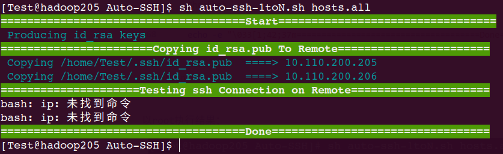

# ssh 免密登录脚本


[TOC]


## 一、需求：

1、给定一个或多个主机IP，放到`hosts.all`文件中，所有主机都已经建好相同用户、设置密码，现在需要配置某一主机（Master）到其他任意主机的ssh无密登录（一到多单向）

2、要求脚本执行过程中没有交互内容，不需要额外输入，中间不能卡顿，一次执行完

3、对于配置成功的以绿色输出IP，失败的以红色输出IP

4、在配置无密登录时可以指定使用什么用户，包括root用户和非root用户

5、ssh端口可能不是默认的22，也需要可以指定

6、并且可以不断向无密登录集群添加任意数量的新主机，当需要向集群添加主机时，只需通过参数指定新的主机文件，不更改原来的 `hosts.all`文件 ，原来的Master还是可以无密登录添加的主机

7、注意Master自己到自己的无密登录

结构如下：

 


## 二、分析

1、生成主机IP文件`hosts.all`，利用echo输出数组

`echo  192.168.1.{100..110}`

```
192.168.1.100 192.168.1.101 192.168.1.102 192.168.1.103 192.168.1.104 192.168.1.105 192.168.1.106 192.168.1.107 192.168.1.108 192.168.1.109 192.168.1.110
```

但是有个问题，需要换行，可以通过下面语句加入换行

```shell
IP_LIST=`echo  192.168.1.{100..110}`
for i in $IP_LIST;do  echo $i >>hosts.all ;done

```

最终hosts.all文件内容类似下面的结构：

```
192.168.1.100
192.168.1.101
192.168.1.102
192.168.1.103
192.168.1.104
192.168.1.105
192.168.1.106
192.168.1.107
192.168.1.108
192.168.1.109
192.168.1.110
```


2、生成ssh key的时候需要连续输入三次回车，有交互，解决办法：利用`-P`选项指定空密码，同时利用`-f`选项指定生成的文件路径~~和名称~~，经过测试发现如果名所指定的密钥名称不是`id_rsa`,ssh-copy-id可以把id_rsa.pub内容复制到authorized_keys中去，但是ssh还是不能登录，所以这里注意名字必须指定`id_rsa` 。最后面用`1>/dev/null`将标准输出屏蔽（不屏蔽标准错误）。

```shell
/usr/bin/ssh-keygen -t rsa -f $HOME/.ssh/id_rsa -P ""  1>/dev/null
```


3、需要把`$HOME/.ssh/id_rsa.pub`文件的内容复制到其他主机的 `$HOME/.ssh/authorized_keys`，解决办法可以scp，然后cat，不过有更好的工具`ssh-copy-id`

```
/usr/bin/ssh-copy-id  -i $HOME/.ssh/id_rsa.pub root@192.168.1.100
```

用`ssh-copy-id`碰到的问题：

需要输入一次yes，解决办法：使用`-o`选项，`-o StrictHostKeyChecking=no`

需要输入对方的密码，解决办法：使用sshpass，需要安装sshpass提前准备好rpm包

指定端口，用`-p`选项

最终代码如下：

```
rpm -ivh sshpass-1.06-1.el7.x86_64.rpm

SSH_PORT=22
SSH_USER=root
SSH_PASSWORD="hadoop123"
SSH_HOST=`cat hosts.all`
/usr/bin/sshpass -p $PASS /usr/bin/ssh-copy-id -p $PORT -i $HOME/.ssh/id_rsa.pub -o StrictHostKeyChecking=no $USER@$host 1>/dev/null 2>&1
```


4、需要考虑原来是否已经生成过key文件,是否需要覆盖的问题，最好不能影响已经生成的key文件

为了不影响原来可能已经存在的id_rsa文件，这里生成key时指定文件名为`id_rsa_SSH`,但是进过测试发现 `ssh-copy-id`虽然把pub文件内容复制到`$HOME/.ssh/authorized_keys`中去了，ssh登录还是需要密码


## 三、代码

`vim auto-ssh-1toN.sh`

```shell
#!/bin/bash

DEFAULT_USER=root
DEFAULT_PASS="hadoop123"
DEFAULT_PORT=22

HOSTS=`cat $1`             
SSH_USER=$DEFAULT_USER
SSH_PASS=$DEFAULT_PASS
SSH_PORT=$DEFAULT_PORT


function ProduceKey()
{
#set -x
	echo -e "\033[36m Producing id_rsa keys \033[0m"	
	/usr/bin/ssh-keygen -t rsa -f $HOME/.ssh/id_rsa -P ""  1>/dev/null 
#set +x
}

function InstallSshpass()
{
#set -x
	echo -e "\033[36m Installing sshpass... \033[0m"
	rpm -ivh ./rpms/sshpass-1.06-1.el7.x86_64.rpm 1>/dev/null;
	command -v sshpass 1>/dev/null && echo -e "\033[36m sshpass install sucess\033[0m" 
#set +x
}

##把.ssh/id_rsa.pub复制到列表主机的.ssh/authorized_keys
function SshCopyId()
{
#set -x
	echo -e "\033[1;42;37m=======================Copying id_rsa.pub To Remote=======================\033[0m"
	for host in $HOSTS
	do
		echo -e "\033[36m Copying $HOME/.ssh/id_rsa.pub  ====> $host\033[0m"	
		/usr/bin/sshpass -p $SSH_PASS /usr/bin/ssh-copy-id -p $SSH_PORT -i $HOME/.ssh/id_rsa.pub -o StrictHostKeyChecking=no $SSH_USER@$host 1>/dev/null 2>&1
		
	done
#set +x
}

##如果到$host主机执行命令grep IP与$host一直则认为ssh配置OK
function Checkssh()
{
#set -x
	echo -e "\033[1;42;37m=====================Testing ssh Connection on Remote=====================\033[0m"
	for  host in $HOSTS
	do
		#echo -e "\033[32m'$host'\033[36m : Checking ssh \033[0m"	
		ssh  $SSH_USER@$host "ip a|grep -o $host 1>/dev/null && ( echo -e '\033[36m Test ssh Sucess on \033[32m    $host \033[0m')"
	done
#set +x
}

function Main()
{
	echo -e "\033[1;42;37m=====================================Start=================================\033[0m"
	ls $HOME/.ssh/id_rsa $HOME/.ssh/id_rsa.pub 1>/dev/null 2>&1 || ProduceKey ##如果已经生成，就不再生成

	command -v sshpass 1>/dev/null || InstallSshpass  ##如果安装了，就不再安装

	SshCopyId
	
	Checkssh
	
	echo -e "\033[1;42;37m=====================================Done=================================\033[0m"
}

Main

```

以root执行结果：

 


以Test执行结果：

 

可以看到测试ssh 连接这一步没有找到`ip`命令，但是单独执行`ip addr`是有结果的

把测试`Checkssh()`函数中查找ip部分改为grep网卡 `grep -rn "10.110.200.205" /etc/sysconfig/network-scripts/*  1>/dev/null` 可以

最终代码为：

```
#!/bin/bash

DEFAULT_USER=Test
DEFAULT_PASS="123456"
DEFAULT_PORT=22

HOSTS=`cat $1`             
SSH_USER=$DEFAULT_USER
SSH_PASS=$DEFAULT_PASS
SSH_PORT=$DEFAULT_PORT


function ProduceKey()
{
#set -x
	echo -e "\033[36m Producing id_rsa keys \033[0m"	
	/usr/bin/ssh-keygen -t rsa -f $HOME/.ssh/id_rsa -P ""  1>/dev/null 
#set +x
}


function InstallSshpass()
{
#set -x
	echo -e "\033[36m Installing sshpass... \033[0m"
	rpm -ivh ./rpms/sshpass-1.06-1.el7.x86_64.rpm 1>/dev/null;
	command -v sshpass 1>/dev/null && echo -e "\033[36m sshpass install sucess\033[0m" 
#set +x
}

##把.ssh/id_rsa.pub复制到列表主机的.ssh/authorized_keys
function SshCopyId()
{
#set -x
	echo -e "\033[1;42;37m=======================Copying id_rsa.pub To Remote=======================\033[0m"
	for host in $HOSTS
	do
		echo -e "\033[36m Copying $HOME/.ssh/id_rsa.pub  ====> $host\033[0m"	
		/usr/bin/sshpass -p $SSH_PASS /usr/bin/ssh-copy-id -p $SSH_PORT -i $HOME/.ssh/id_rsa.pub -o StrictHostKeyChecking=no $SSH_USER@$host 1>/dev/null 2>&1
		
	done
#set +x
}

##如果到$host主机执行命令grep IP与$host一直则认为ssh配置OK
function Checkssh()
{
#set -x
	echo -e "\033[1;42;37m=====================Testing ssh Connection on Remote=====================\033[0m"
	for  host in $HOSTS
	do
		#echo -e "\033[32m'$host'\033[36m : Checking ssh \033[0m"	
		#ssh  $SSH_USER@$host "ip a|grep -o $host 1>/dev/null && ( echo -e '\033[36m Test ssh Sucess on \033[32m    $host \033[0m')"
		ssh  $SSH_USER@$host "grep -rn $host /etc/sysconfig/network-scripts/ 1>/dev/null && ( echo -e '\033[36m Test ssh Sucess on \033[32m    $host \033[0m')"
	done
#set +x
}


function Main()
{
	echo -e "\033[1;42;37m=====================================Start=================================\033[0m"
	ls $HOME/.ssh/id_rsa $HOME/.ssh/id_rsa.pub 1>/dev/null 2>&1 || ProduceKey ##如果已经生成，就不再生成

	command -v sshpass 1>/dev/null || InstallSshpass  ##如果安装了，就不再安装

	SshCopyId
	
	Checkssh
	
	echo -e "\033[1;42;37m=====================================Done=================================\033[0m"
}

Main

```


 


## 四、改进一

1、给定一个或多个主机IP，放到`hosts.all`文件中，所有主机都已经建好相同用户、设置密码，现在需要配置所有主机**任意两两之间的ssh（多到多双向）**

2、要求脚本执行过程中没有交互内容，不需要额外输入，中间不能卡顿，一次执行完

3、对于配置成功的以绿色输出IP，失败的以红色输出IP

4、在配置无密登录时可以指定使用什么用户，包括root用户和非root用户

5、ssh端口可能不是默认的22，也需要可以指定

6、并且可以不断向无密登录集群添加任意数量的新主机，当需要向集群添加主机时，只需通过参数指定新的主机文件，不更改原来的 `hosts.all`文件 ，原来的Master还是可以无密登录添加的主机

7、注意Master自己到自己的无密登录

结构如下：

 

`vim auto-ssh-NtoN.sh`

```

```


## 五、改进二


需求变更为：

1、给定`hosts-with-pass.all`文件,里面每一行的内容按照 IP  USER  PASSWORD  SSH_PORT的顺序，存放一个或多个主机IP、需要配置ssh的用户、密码、该主机ssh使用的端口，要求根据该文件配置所有主机任意两两之间的免密登录（用户、密码、端口不一致）

2、要求脚本执行过程中没有交互内容，不需要额外输入

3、对于配置失败的信息以红色语句输出该主机IP

4、当需要向集群添加主机时，只需指定新的主机文件，不更改原来的 hosts.all ，既可以配置原主机+新主机任意两两之间的ssh无密登录，并且可以不断向无密登录集群添加任意数量的新主机


## 六、测试


1、root用户测试

删除`$HOME/.ssh/`文件夹测试

关闭hosts.all中的部分主机


2、非root用户测试

删除`$HOME/.ssh/`文件夹测试

关闭hosts.all中的部分主机


